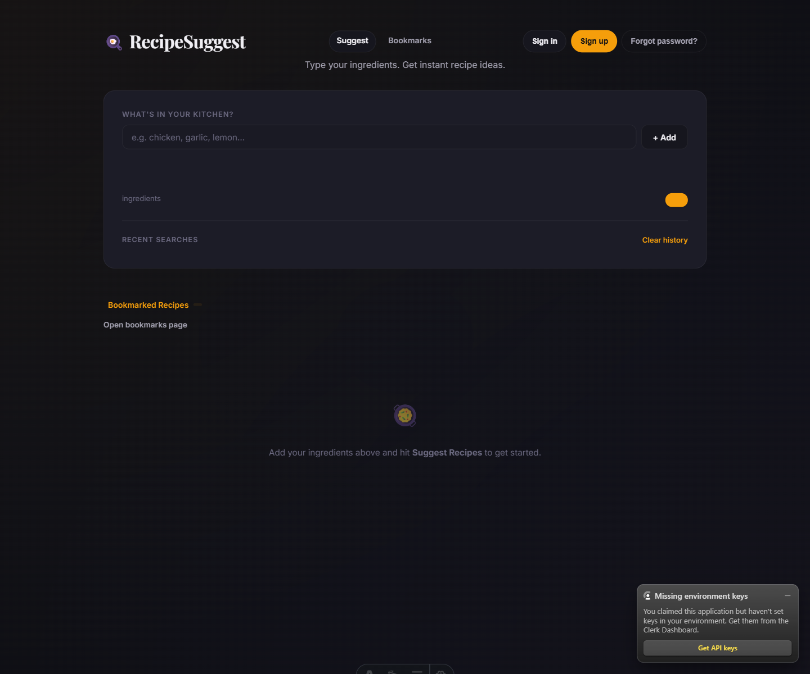
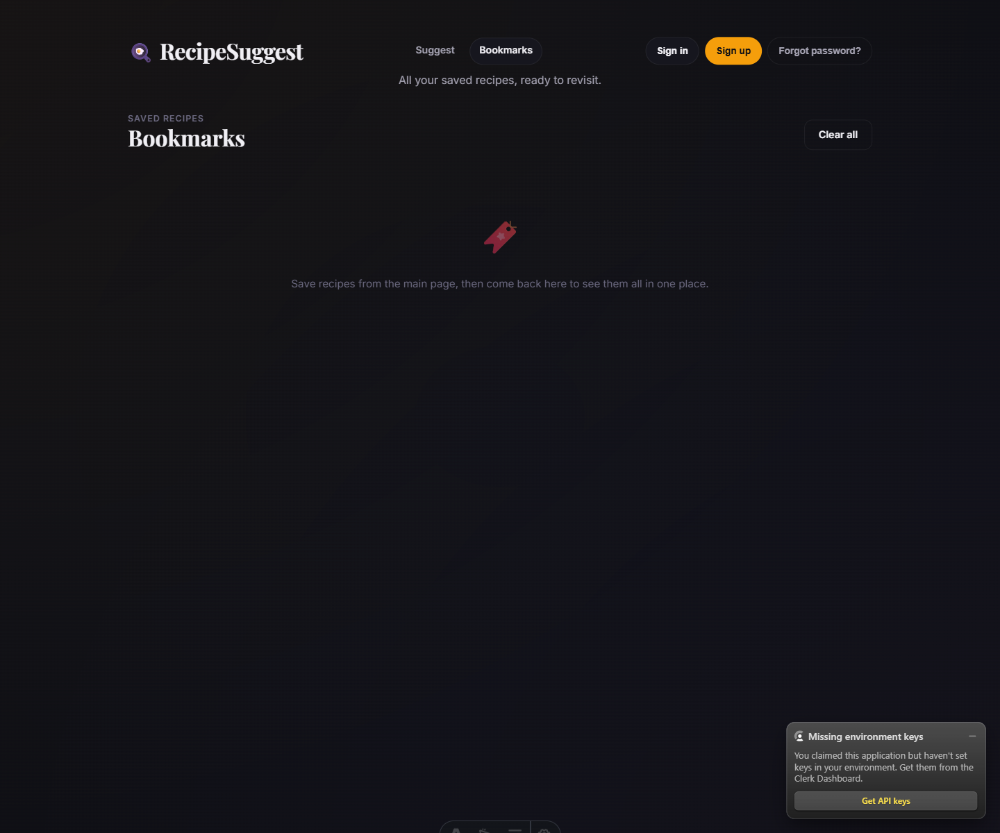

# RecipeSuggest Project Overview

This document summarizes the tech stack used in the project, the major product features currently implemented, and the current UI captured from the running Astro app.

## Tech Stack

### Core framework

- `Astro 6`
- `Server output` mode enabled
- `@astrojs/netlify` adapter for SSR-style deployment on Netlify

### Frontend

- `Astro` pages and layouts for rendering
- `Alpine.js` for lightweight client-side interactivity
- `HTMX` for partial page updates and form-driven search results
- Custom CSS in `public/styles/global.css`

### Authentication

- `@clerk/astro`
- Clerk middleware via `src/middleware.ts`
- Clerk modal sign-in, sign-up, and forgot-password entry points in the site header

### AI / backend integrations

- `openai` Node SDK
- Recipe generation through the OpenAI chat completions API
- Bookmark image generation through the OpenAI Images API

### State and persistence

- `localStorage` for bookmarked recipes
- `localStorage` for recent ingredient search history
- In-memory server cache for repeated recipe suggestion requests with the same ingredient combination

### Runtime / tooling

- Node `22.12.0+` required
- npm as the package manager
- Git + GitHub for source control

## Key Features

### 1. Ingredient-based recipe suggestion

Users can enter ingredients manually, build a tag list, and submit the list to the `/api/suggest` endpoint. The API returns recipe suggestions with:

- title
- description
- cook time
- difficulty
- ingredients
- instructions

### 2. Search history

The homepage stores the last 20 unique ingredient combinations in `localStorage`.

Behavior:

- duplicate combinations are deduplicated
- newest searches appear first
- each saved search can be clicked to re-run it
- users can clear all search history

### 3. Bookmarks on the homepage

Users can bookmark generated recipes directly from the results grid.

Behavior:

- bookmarks persist in `localStorage`
- the homepage shows a collapsible bookmarked-recipes section
- bookmarked cards can still be opened from the main page

### 4. Dedicated bookmarks page

The app includes a standalone `/bookmarks` page that lists all saved recipes in a larger, richer layout.

Behavior:

- shows all bookmarked recipes
- includes title, description, time, difficulty, ingredients, and instructions
- includes a `Clear all` button
- includes individual `Remove` buttons

### 5. Generated bookmark images

When the bookmarks page loads, any recipe without an image triggers a request to `/api/bookmark-image`.

Behavior:

- image generation runs only for missing images
- generated images are persisted back into bookmark storage
- the UI shows a loading placeholder while the image is being created

### 6. Clerk authentication flow

The header includes Clerk-powered auth actions:

- `Sign in`
- `Sign up`
- `Forgot password?`

Current behavior:

- signed-out users see modal entry points
- signed-in users see Clerk’s `UserButton`
- the forgot-password flow is routed through Clerk’s sign-in experience

### 7. Responsive dark-themed UI

The app uses a dark editorial visual style with:

- display typography for branding and section titles
- glassy card surfaces
- animated cards and skeleton loading states
- badge-based recipe difficulty labeling

## Notable Routes and Files

### Pages

- `src/pages/index.astro`
- `src/pages/bookmarks.astro`
- `src/pages/sign-in.astro`
- `src/pages/sign-up.astro`

### API routes

- `src/pages/api/suggest.astro`
- `src/pages/api/bookmark-image.astro`

### Shared logic and styling

- `src/lib/recipes.ts`
- `src/layouts/Base.astro`
- `public/styles/global.css`
- `src/middleware.ts`

## Screenshot Gallery

## Homepage

What this screen shows:

- top navigation with `Suggest` and `Bookmarks`
- Clerk auth actions in the header
- ingredient input area with add button
- recent-search history block below the input panel
- bookmarks entry point from the homepage
- empty-state area before recipe results are loaded

Notes:

- the screenshot was captured in a local development session
- the Clerk “Missing environment keys” notice appears because Clerk keys were not configured in the running local environment at capture time

## Bookmarks Page

What this screen shows:

- dedicated bookmarks route layout
- page header for saved recipes
- `Clear all` action
- empty-state messaging when no bookmarked recipes are present
- auth actions carried over consistently from the homepage

Notes:

- when bookmarks exist, this area becomes a full recipe card grid with image support
- image placeholders are replaced automatically as generated bookmark images become available

## Current Product State

The project is no longer a starter template. It now has three primary layers:

- public recipe discovery and search
- saved-personal-content management through bookmarks and history
- account access through Clerk

The current architecture is still lightweight. Persistence is browser-local for user content, while AI generation and auth are handled server-side through external services.
